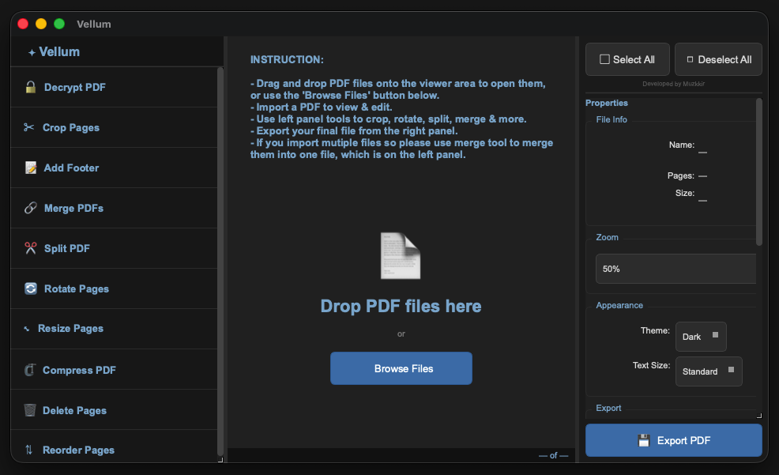

# Vellum

> ⭐ **If you found Vellum helpful, please consider leaving a star on this repository!**

***

# Vellum
**The uncompromising, offline-first PDF studio.**




Vellum is a free, offline, secure PDF editor for macOS, Windows, and Linux. It lets you decrypt, crop, merge, split, rotate, resize, compress, reorder, delete pages, and add footers. All locally, with non-destructive editing and a rare true Undo system.

Stop uploading your sensitive documents to random cloud services. Vellum is a completely free, highly secure, offline desktop PDF editor designed for privacy, speed, and precision. 

Built to handle everyday document tasks seamlessly, Vellum introduces features rarely seen in lightweight PDF utilities—like a true chronological Undo system and a strictly non-destructive workflow. Your original files are never altered; Vellum does all the heavy lifting in a secure temporary environment until you are ready to export.

# Usage

```bash
# Clone the repository
git clone https://github.com/mymuzzy/vellum.git
cd vellum

# Create and activate virtual environment
python3 -m venv venv
source venv/bin/activate  # macOS/Linux
# or
venv\Scripts\activate  # Windows

# Install all required libraries in one go
python3 -m pip install PyQt6 PyMuPDF pypdf reportlab

# Run Vellum
python3 main.py
```

**Import a PDF** → Select a tool from the left panel → Configure options → Click "Make Changes" → Export to your folder.

All edits happen in a secure temp folder. Your original files stay untouched.

## ✨ Why Vellum?

* **Absolute Privacy:** 100% offline. No cloud processing, no telemetry, no subscriptions.
* **Non-Destructive Workflow:** Your original files are sacred. Vellum creates a unique session environment for edits and only generates a new file when you hit export.
* **True 'Undo' History:** Made a mistake with a crop or rotation? A rare feature in standalone PDF tools, Vellum’s Undo system lets you instantly step back to your previous state.
* **Smart 3-Panel Interface:** 
  * *Left:* Always-expanded, zero-friction toolbox.
  * *Center:* Interactive, scrollable PDF viewport with multi-page selection.
  * *Right:* Real-time document metadata (file size, page count), intelligent export routing, and granular zoom controls (10% to 1000%).
* **Eye-Care Themes:** Beautifully crafted Dark and Light modes.

## 🧰 The Toolbox

Vellum packs a comprehensive suite of tools directly into the left panel, ready to use on individual pages, specific ranges, or the entire document:

* 🔓 **Decrypt PDF** — Unlock password-protected PDFs locally.
* 🔗 **Merge PDFs** — Combine and seamlessly reorder multiple PDFs into a single file.
* ✂️ **Split PDF** — Extract specific page ranges to create new standalone files.
* ✂ **Crop Pages** — Precisely crop margins and white space from page edges.
* ⤡ **Resize Pages** — Intelligently scale content to match a reference page width perfectly.
* 🔄 **Rotate Pages** — Rotate selected pages left or right by 90°.
* ⇅ **Reorder Pages** — Move pages up, down, or to a specific exact position.
* 📝 **Add Footer** — Inject rotation-aware page numbers or custom text footers.
* 🗜 **Compress PDF** — Smart, iterative compression using Ghostscript or built-in algorithms to hit your target file size without ever accidentally increasing it.
* 🗑 **Delete Pages** — Instantly remove selected pages from your document.

## 🚀 Getting Started

Vellum is built to be cross-platform, running flawlessly on macOS, Windows, and Linux. 

*(Note: Detailed installation instructions, binary releases, and full documentation will be available in the project Wiki soon.)*

**Prerequisites for running from source:**
* Python 3.x
* PyQt6
* PyMuPDF (`fitz`)
* pypdf
* reportlab
* Ghostscript (required for advanced compression) [optional]

## 👨‍💻 Credits

**Developed by Muzkkir**  
Built with a focus on delivering a premium, secure, and intuitive utility for professionals who take their data privacy seriously.

## 📄 License

This project is licensed under the MIT License.

```text
MIT License

Copyright (c) 2026 Muzkkir

Permission is hereby granted, free of charge, to any person obtaining a copy
of this software and associated documentation files (the "Software"), to deal
in the Software without restriction, including without limitation the rights
to use, copy, modify, merge, publish, distribute, sublicense, and/or sell
copies of the Software, and to permit persons to whom the Software is
furnished to do so, subject to the following conditions:

The above copyright notice and this permission notice shall be included in all
copies or substantial portions of the Software.

THE SOFTWARE IS PROVIDED "AS IS", WITHOUT WARRANTY OF ANY KIND, EXPRESS OR
IMPLIED, INCLUDING BUT NOT LIMITED TO THE WARRANTIES OF MERCHANTABILITY,
FITNESS FOR A PARTICULAR PURPOSE AND NONINFRINGEMENT. IN NO EVENT SHALL THE
AUTHORS OR COPYRIGHT HOLDERS BE LIABLE FOR ANY CLAIM, DAMAGES OR OTHER
LIABILITY, WHETHER IN AN ACTION OF CONTRACT, TORT OR OTHERWISE, ARISING FROM,
OUT OF OR IN CONNECTION WITH THE SOFTWARE OR THE USE OR OTHER DEALINGS IN THE
SOFTWARE.
```
